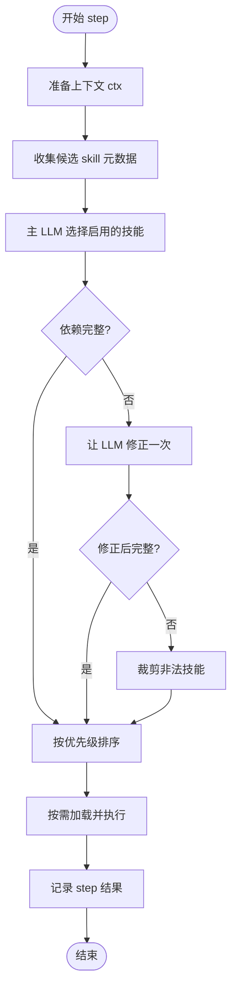
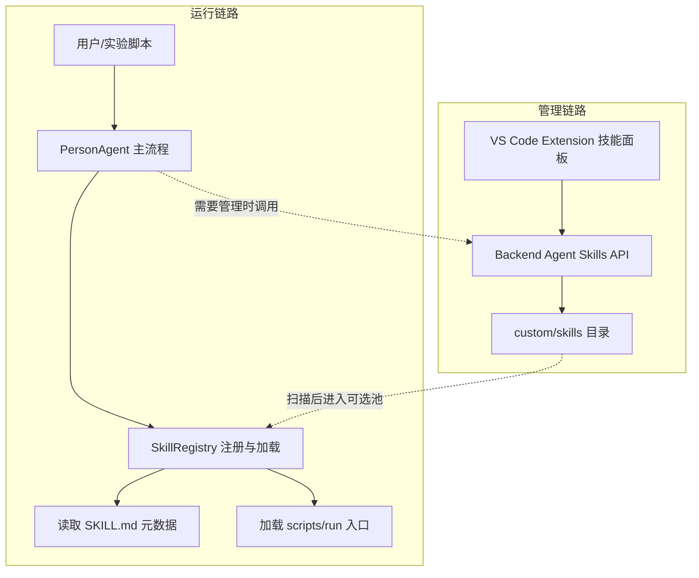
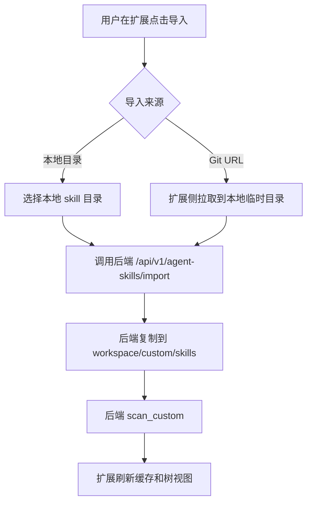
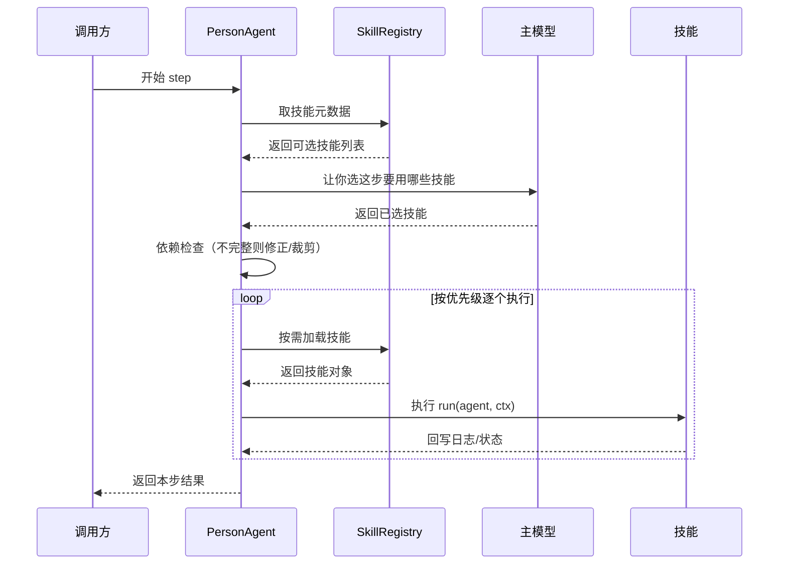
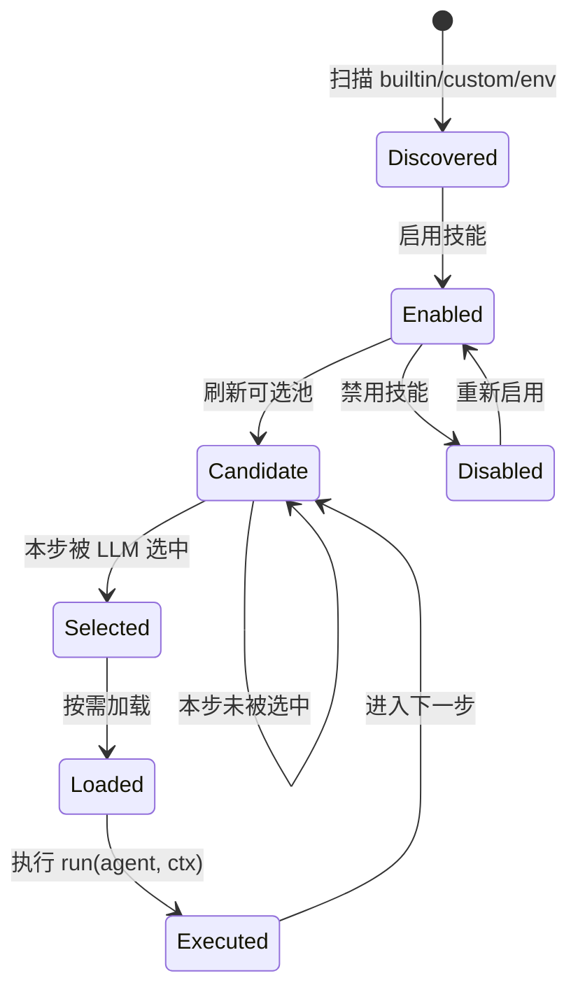

# Agent Skills 工作流程说明

## 快速了解

1. 默认不预加载任何 skill。
2. 每个 step 只运行 LLM 选中的 skill。
3. 选择阶段只看元数据，不看 SKILL.md 全文。
4. 依赖不自动补选，缺依赖先让 LLM 修正，再裁剪非法项。
5. memory 没被选中时不会 flush，但缓冲会跨 step 保留。
6. Agent close 时会兜底 flush，避免静默丢记忆。

## 0. 一句话先讲清楚

当前 Agent Skills 的原则 “原始人模式-用啥学啥”：

1. 默认不预加载技能。
2. 每一步只运行主 LLM 选中的技能。
3. 没被选中就不运行，全凭 LLM 自身能力。

---

## 1. 这套机制解决了什么问题

1. 大幅减少 LLM 的计算压力。
2. 提升多 Agent 协同的灵活性。
3. 便于个性化自定义技能的导入和使用。

---

## 2. 每个 step 到底发生了什么



---

## 3. 目录和文件结构

### 3.0 架构关系图



### 3.1 核心代码结构

```text
packages/agentsociety2/agentsociety2/
├── agent/
│   ├── person.py                      # Step 主流程 + 选择 + 执行
│   ├── models.py                      # SkillMetaSelection 等结构化模型
│   └── skills/
│       ├── __init__.py                # SkillRegistry（扫描/加载/依赖解析）
│       ├── observation/
│       ├── needs/
│       ├── cognition/
│       ├── plan/
│       └── memory/
├── backend/routers/
│   └── agent_skills.py                # /api/v1/agent-skills 路由
└── ...

extension/
└── src/
    ├── apiClient.ts                   # 调用后端 skill API
    └── projectStructureProvider.ts    # UI 导入/扫描/刷新逻辑
```

### 3.2 单个 Skill 目录结构

```text
<skill-name>/
├── SKILL.md
└── scripts/
    └── <entry>.py
```

约定：

1. `SKILL.md` 放 frontmatter 元数据和行为说明。
2. 入口脚本必须导出 `async def run(agent, ctx)`。

---

## 4. 加载机制（Loading）

### 4.1 初始化：不预加载

`PersonAgent.__init__` 的行为：

1. `_loaded_skills` 初始化为空。
2. 只刷新可选技能池。
3. 不预加载任何 skill 代码。

### 4.2 执行期：按需加载

`_get_or_load_skill(name)`：

1. 命中缓存就复用。
2. 否则调用 `SkillRegistry.load_single(name, load_dependencies=False)`。
3. 成功后写入缓存。

### 4.3 可选池刷新：显式触发

不会每个 step 自动刷新。常见刷新入口：

1. `reload_skills()`。
2. `init()` 扫描到 env 附带技能之后。
3. `add_skill()` / `remove_skill()`。
4. 前端执行“扫描 Skills”或导入流程后刷新。

---

## 5. 选择机制（Selection）

### 5.1 选择阶段只看元数据

`list_selection_metadata(...)` 导出的字段：

1. `name`
2. `description`
3. `priority`
4. `requires`
5. `provides`
6. `provides_state`
7. `source`

不会读取 `SKILL.md` 全文，不触发代码导入。

### 5.2 结构化输出，避免自由文本歧义

`SkillMetaSelection`：

1. `selected_skills`
2. `reasoning`
3. `rationale_by_skill`

---

## 6. 依赖策略

1. 对已选技能做依赖检查。
2. 缺依赖时，给主 LLM 一次修正机会，可加依赖或删依赖方。
3. 仍不合法则裁剪非法技能。

---

## 7. memory 行为

1. cognition/needs 等技能会把内容写入 `_cognition_memory` 缓冲区。
2. 如果当步选中了 `memory`，就会 flush 到长期记忆。
3. 如果当步没选中 `memory`，缓冲不会清空，会保留到后续 step。
4. `close()` 时会做一次兜底 flush，避免静默丢数据。

---

## 8. 自定义技能导入与刷新

### 8.1 流程图（导入/扫描）



### 8.2 后端能力

`/api/v1/agent-skills`：

1. `POST /scan`
2. `POST /import`（目录导入）
3. `POST /enable` / `POST /disable`
4. `POST /reload`
5. `GET /list` / `GET /{name}/info`
6. `POST /remove`（仅 custom）

### 8.3 前后端边界

1. 后端 import 只收“本地目录路径”。
2. Git URL 方式由 extension 先拉取落地，再调用目录导入 API。

---

## 9. 内置技能职责速览

### 9.1 observation

1. 做环境观测。
2. 若环境返回 `in_progress`，可短路当前 step。
3. `priority: 0`，通常最先运行。

### 9.2 needs

1. 调整需求满足度（satiety/energy/safety/social）。
2. 产出当前主需求 `current_need`。
3. 常见依赖：`observation`。

### 9.3 cognition

1. 合并更新情绪、思考、意图。
2. 产出 `cognition_ran=True`。
3. 会向 `_cognition_memory` 写入缓冲内容。

### 9.4 plan

1. 基于意图生成计划并执行。
2. 通过 ReAct 循环与环境交互。
3. 常见依赖：`observation + cognition`。

### 9.5 memory

1. 把 `_cognition_memory` 缓冲刷入长期记忆。
2. 按条件触发 `_query_current_intention()`。
3. 未被选中时不会运行，但缓冲会保留待后续 flush。

---

## 10. 开发建议

1. 新 Skill 至少提供：`name/description/priority`。
2. `description` 写“什么时候该选我”，不要只写“我能做什么”。
3. `requires` 只写硬依赖，避免过度约束。
4. 入口脚本外的 helper 文件，需要在入口里显式 import 才会生效。
5. 上传新 skill 后，记得触发 scan/import 刷新，不要等每步自动发现。

---

## 11. Step 小白版（先看这个）

把一个 step 想成“点菜 + 下单 + 做菜”：

1. Agent 先看菜单（技能元数据）。
2. 主模型决定这步要用哪些技能。
3. 如果依赖不完整，先修一次；还不行就删掉有问题的技能。
4. 按优先级从高到低，逐个加载并执行技能。
5. 把本步日志和结果打包返回。



一句话记忆：先选技能，再修依赖，最后按优先级执行。

---

## 12. Skill 生命周期图



---

## 13. 最小实操示例

下面给一个最小可运行的自定义 skill 示例，方便快速验证导入链路。

目录：

```text
custom/skills/hello-memory/
├── SKILL.md
└── scripts/
    └── hello_memory.py
```

SKILL.md：

```yaml
---
name: hello-memory
description: 在需要记录简短日志时可启用，向 cognition memory 写入一条调试信息。
priority: 65
requires:
    - observation
provides:
    - debug_memory
---

# Hello Memory

用于验证自定义 skill 导入、选择、执行链路是否正常。
```

scripts/hello_memory.py：

```python
from __future__ import annotations
from typing import Any


async def run(agent: Any, ctx: dict[str, Any]) -> None:
    agent._add_cognition_memory(
        "hello-memory executed",
        memory_type="debug",
    )
    ctx["step_log"].append("hello-memory:ok")
```

验证步骤：

1. 在扩展中执行导入（本地目录或 Git URL）。
2. 执行扫描技能。
3. 查看技能列表确认出现 hello-memory。
4. 跑一个 step，检查日志中是否出现 hello-memory:ok。

---